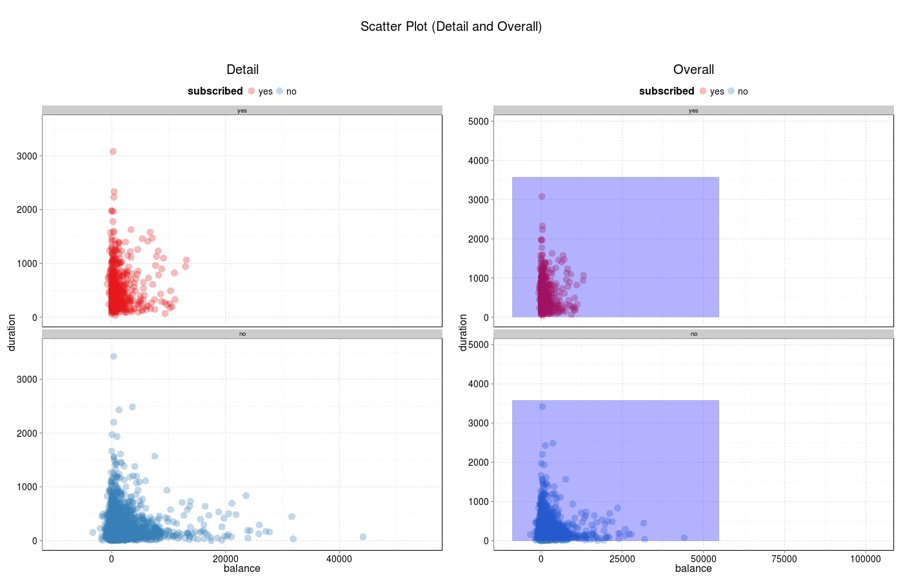
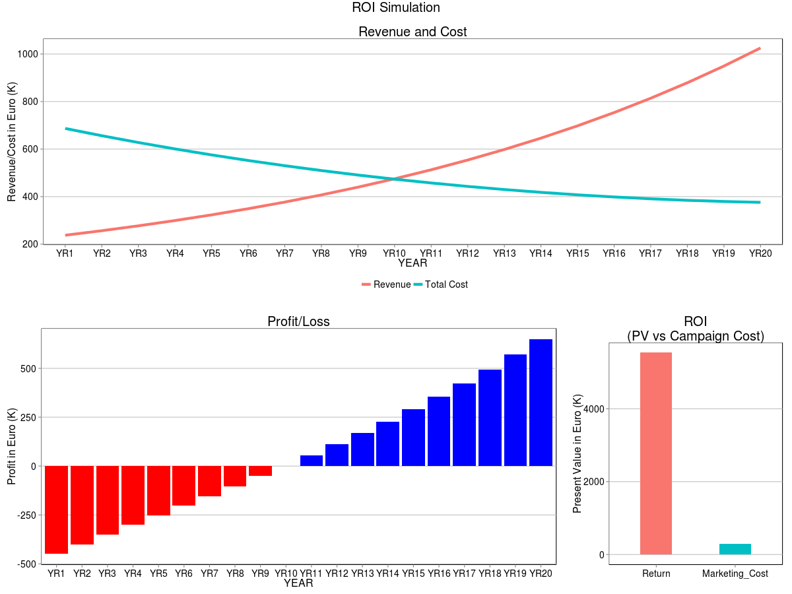
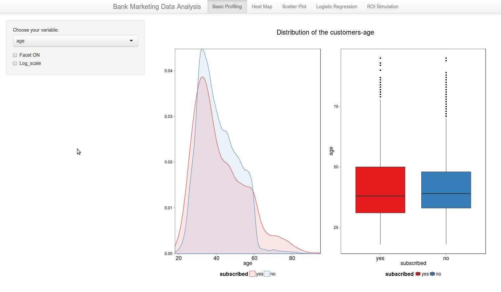
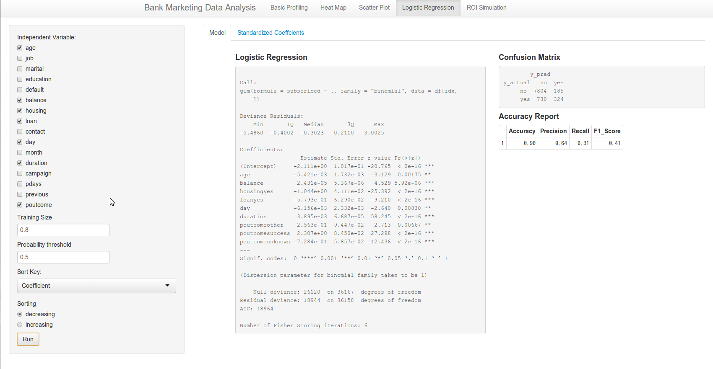
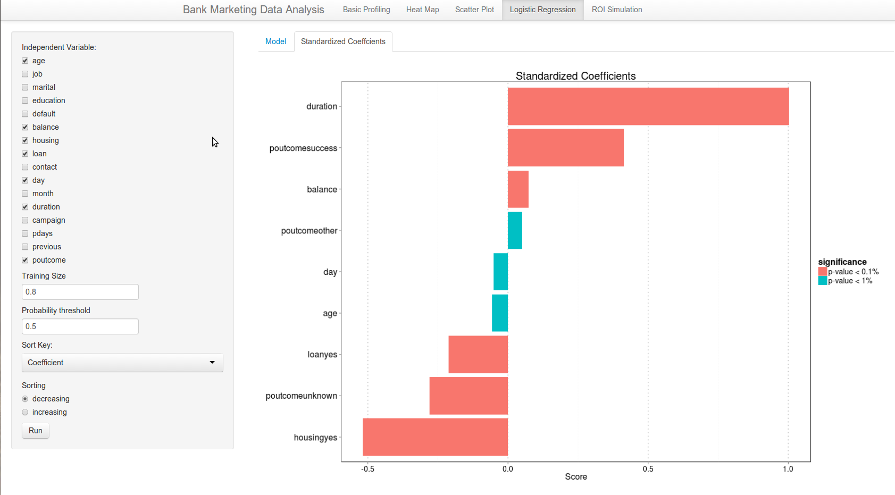

Final Project
==============================

| **Name**  | Yosuke Katada  |
|----------:|:-------------|
| **Email** | ykatada@dons.usfca.edu |

## Instruction ##
Before you start shiny app, please make sure that you install the following packages:
- `ggplot2`
- `reshape2` 
- `reshape` 
- `scales` 
- `grid` 
- `plyr` 
- `RColorBrewer` 

After that, use the following code to run this `shiny` app:

```
library(ggplot2)
library(reshape2)
library(reshape)
library(scales)
library(grid)
library(plyr)
library(RColorBrewer)
library(shiny)
runGitHub("msan622", "yosukekatada", subdir = "final-project")
```

## Discussion ##

### Dataset ###
The dataset is about the customers' response to a direct marketing campaigns for getting term deposit customers at a Portuguese banking institution. The data has 45211 rows and 17 variables. Each row represents each customer. The independent variables are demographic, transaction-based and historical marketing reactions. A dependent variable is "has the client subscribed a term deposit?", which is binary response. 

Also, I changed the order of factor levels about the binary response, ("No", "Yes) , regarding whether a customer accepted the campagin for visualization. Originally, the order of the levels was "No" and "Yes". However, the audiences seem to be interested in how many or much percentage of customers accepted the campagin. So, I changed the order of the factor levels from ("No", "Yes") to ("Yes", "No").

The following is the first 10 data points.


#### Target User ####
I suppose that this shiny app tries to help a marketing analytics personel to analyze the data, get the inights, and finally evaluate ROI of the marketing campaign. This application consists of four components: Univariate plots, Multivariate plots, Modeling, and ROI simulation. 

The following is a summary about how each component associates with techniques and interactivity.

| **Component**  | **Techniques**  | **Interactivity**  |
|:----------|:-------------|:-------------|
| Basic Profiling (Univariate plots) | - Density plot and Box plot - Bar chart and 100% Bar chart | Switch between a single plot and small multiple |
| Multivariate Plots | - Heat Map - Scatte Plot | Zooming |
| Modeling | Bar Chart | Sorting |
| ROI Simulation | Line Chart - Bar Chart | None |


### Techniques ###

#### Basic Profiling (Univariate plots) ####

##### Density plot and Box plot #####


##### Bar chart and 100% Bar chart#####


#### Multivariate Plots ####

##### Heat Map #####


##### Scatter Plot #####


#### Modeling ####
##### Bar Chart #####


#### ROI Simulation ####
##### Multiple Line Plot #####




### Interactivity ###

#### Basic Profiling (Univariate plots) ####




#### Heat Map (Multivariate Plots) ####


#### Scatter Plot (Multivariate Plots) ####


#### Modeling ####



#### ROI Simulation ####


### Prototype Feedback ###


### Challenges ###