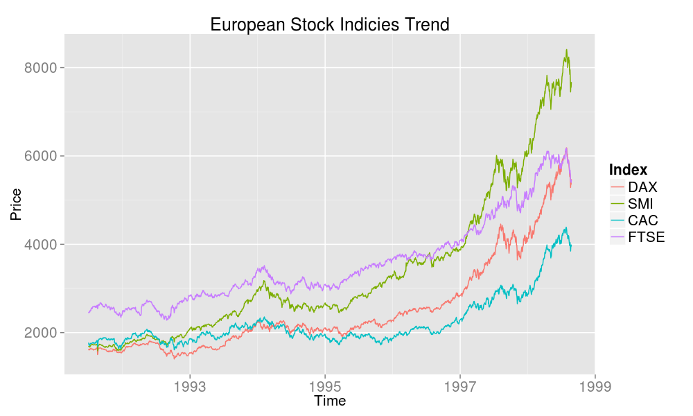

Homework 1: Basic Charts
==============================

| **Name**  | Yosuke Katada  |
|----------:|:-------------|
| **Email** | ykatada@dons.usfca.edu |

## Instructions ##

Prior to running my code, please install the following packages.
- `ggplot2`
- `reshape2`
- `devtools`

Also, To keep PNG files, please specify your working directory before running the code because by using `setwd()`. 

In summary, the following is the R code to run my code.

```
library(devtools)
setwd("/your_working_directory") 
source_url("https://raw.githubusercontent.com/yosukekatada/msan622/9df534c38d8d635dc12849195763b8ccb9aa886b/homework1/MSAN622_HW1.R")
```


## Discussion 1: Movies Data##

###Plot 1: Scatterplot

Although I expected that "budget" is somewhat positively correlated to "rating", it is not true. Even if the budget is almost zero, many movies have high ratings. Also, I notice that the range of rating converges as the budget increases. 

####Customization
In terms of customization of the chart, I enlarged the fonts of title, the labels on the axes for making the audience easily understand them.


***

###Plot 2: Bar Chart
According to the bar chart below, the distribution is not uniform. Therefore, I can guess that each genre has different partter on scatter plot of "budget vs rating".

####Customization
As well as the first chart, I made the font size bigger. Also, in order to make the audience easily read the labels, I rotated the chart because the most important information is genre in this chart. Finally, I chaged color from the default color to the darker blue because I want the audience not to pay attention to the meaning of the color itself. 


***
###Plot 3: Small Multiples
When I look at the multiple scatter plots as below, there looks major two patters. FIrst, the parttern is that the range of rating shrinks as the budget increases. "Action", "Comedy", "Drama", "Mixed", and "None" fall in this pattern. The second pattern is that budget is almost zero, although rating has a large variation. "Documentary" and "Short" are in this pattern. "Animation" and "Romance" are not fitted in those two patterns. Regarding Animation, budget is unrelated to rating. When it comes to "Romance", I cannot say that there is some specific pattern.

####Customization
The most important information on this chart is the differences among the distributions. Therefore, I made the legend's font bigger. 


***


## Discussion 2: Stock Data##
###Plot 4: Multi-Line Chart
The following line chart shows the trends for major European stock indices during 1990s. Overall, all the indicies have the same trend, but you would notice that Swiss Market Index (SMI) went up more sharply than other indices from 1995. On the other hand, the growth of FTSE, representing London Stock Exchange, was slower. 

####Customization
As the discussion above, I want the audience to pay attention to the trend of each index. So, I enlarged legend's fonts as well as x and y axis labels. 


